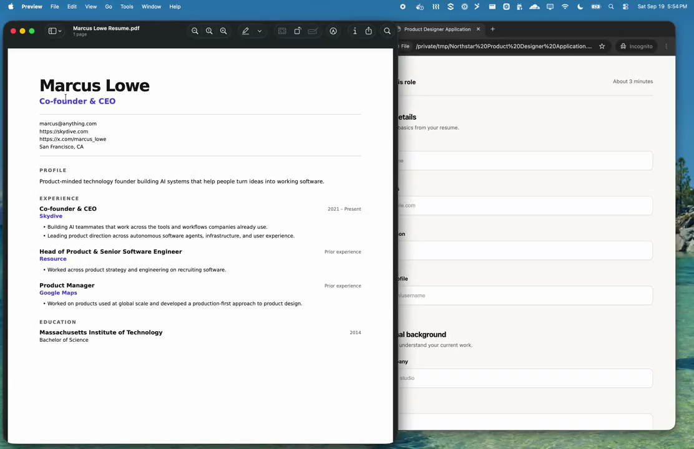
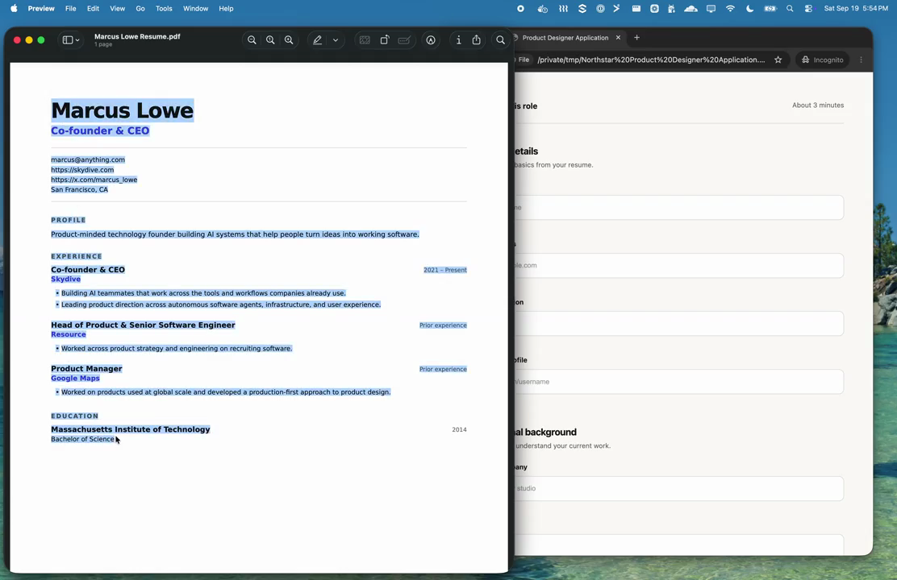
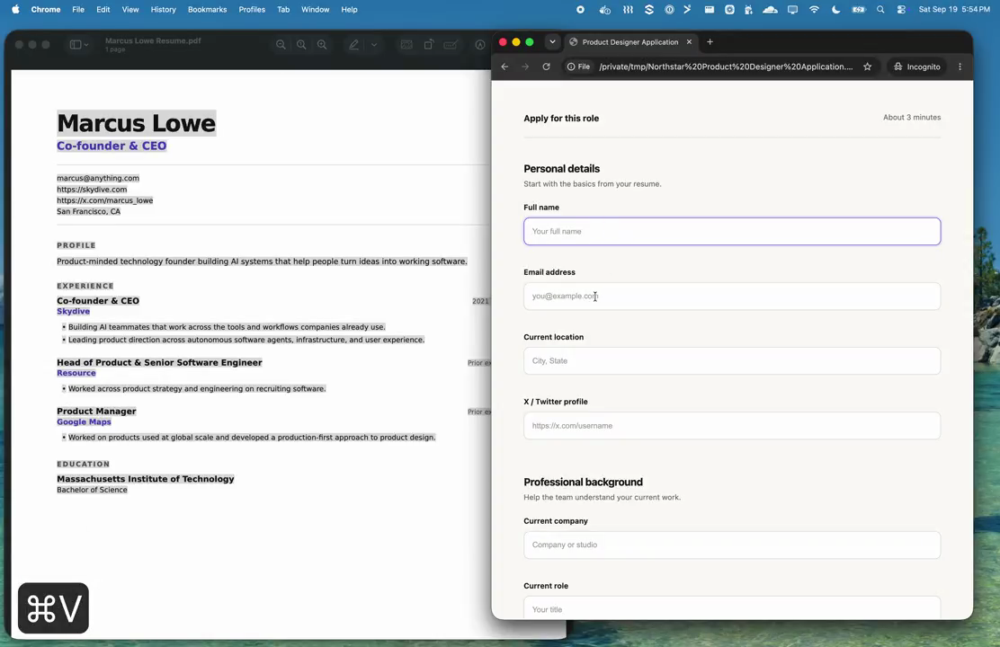
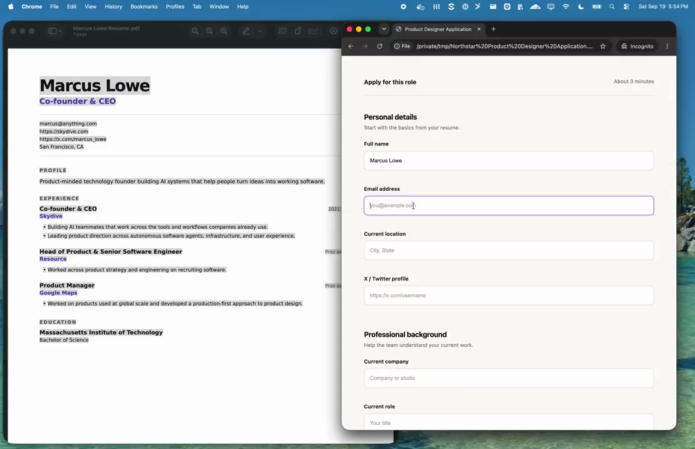
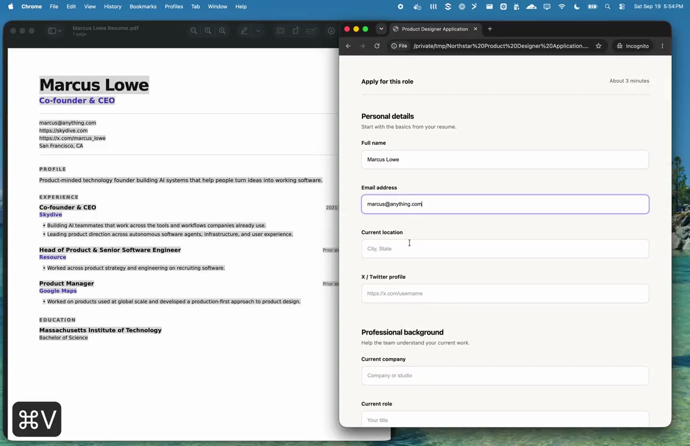
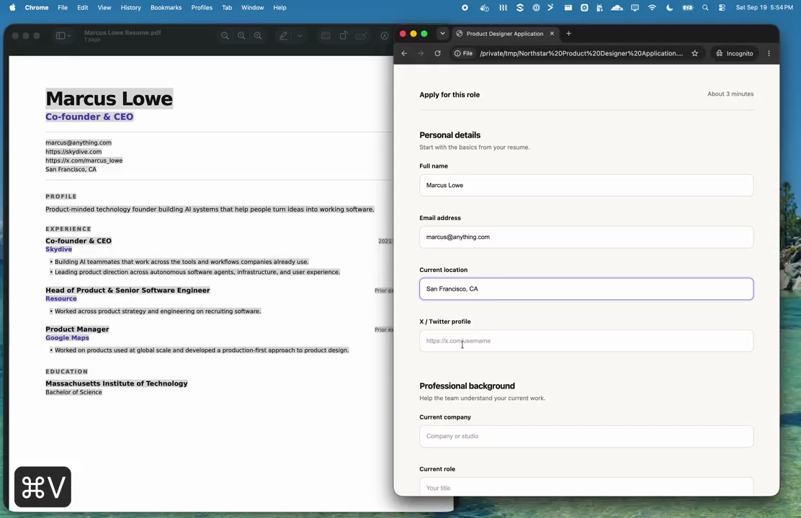
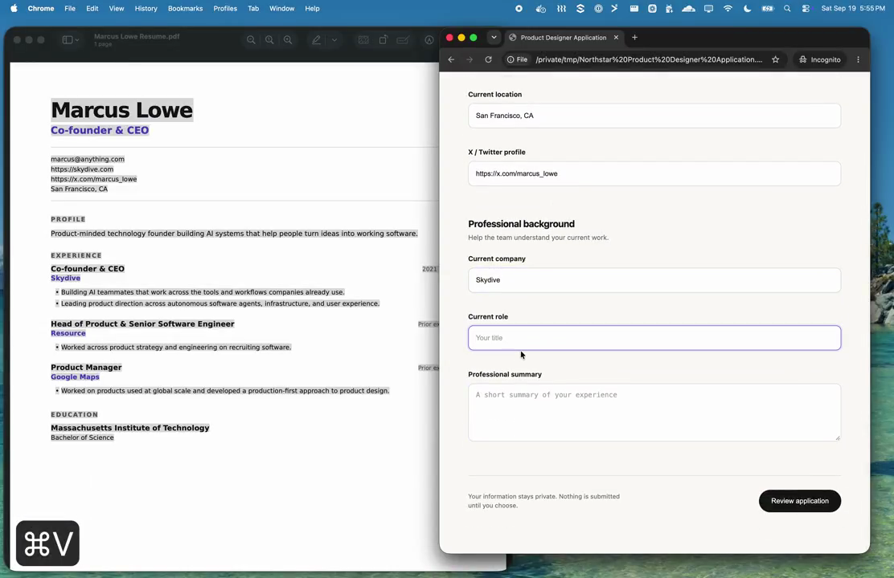
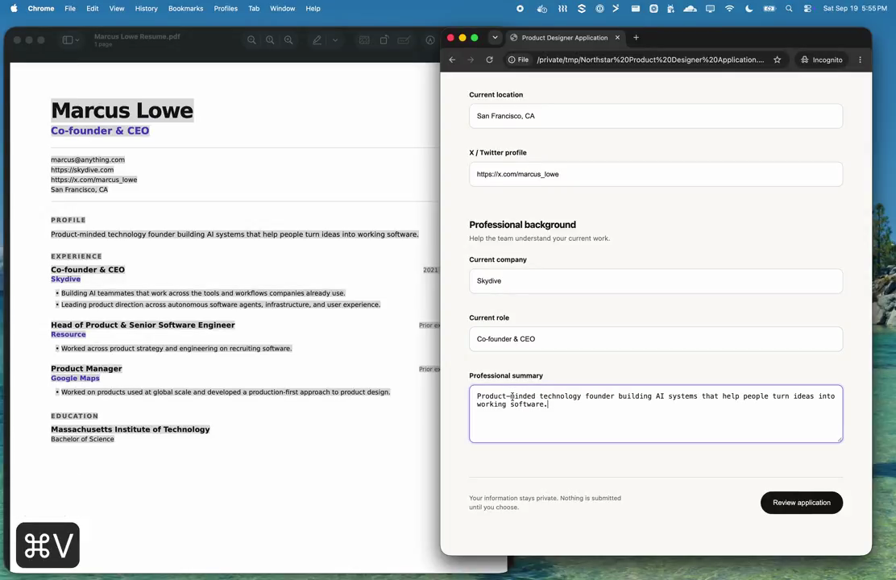
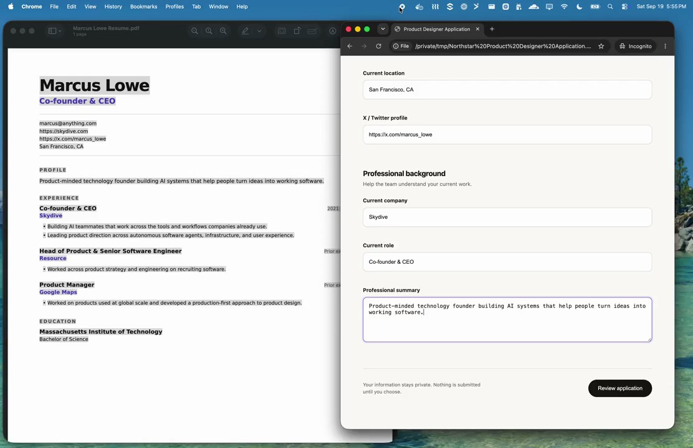

# Smart Copy/Paste Analysis (Jev)

## Tweet Reference

- **Tweet URL**: [https://x.com/marcus_lowe/status/2101476399488160013](https://x.com/marcus_lowe/status/2101476399488160013)
- **Author**: Marcus Lowe ([@marcus_lowe](https://x.com/marcus_lowe))
- **Tweet Text**:
  > "what if copy/paste was smart?
  > powered by @typesafeai jev
  > it feels like every computer interaction will get rewritten"
- **Attached Media**: 21.78s screen recording (`video.mp4`)

---

## Environment Setup in Video

1. **Left Window**: macOS Preview
   - **Document**: `Marcus Lowe Resume.pdf`
   - **Document Content**:
     - **Name**: `Marcus Lowe`
     - **Title**: `Co-founder & CEO`
     - **Email**: `marcus@anything.com`
     - **Website**: `https://skydive.com`
     - **X / Twitter**: `https://x.com/marcus_lowe`
     - **Location**: `San Francisco, CA`
     - **Profile**: `Product-minded technology founder building AI systems that help people turn ideas into working software.`
     - **Experience**:
       - `Co-founder & CEO` at `Skydive` (2021 – Present)
       - `Head of Product & Senior Software Engineer` at `Resource` (Prior experience)
       - `Product Manager` at `Google Maps` (Prior experience)
     - **Education**: `Massachusetts Institute of Technology` (`Bachelor of Science`, 2014)

2. **Right Window**: Google Chrome
   - **Page**: `file:///private/tmp/Northstar%20Product%20Designer%20Application.html`
   - **Form Heading**: `Product Designer Application`
   - **Sections & Fields**:
     - **Section 1: Personal details**
       - Field: `Full name` (placeholder: `Your full name`)
       - Field: `Email address` (placeholder: `you@example.com`)
       - Field: `Current location` (placeholder: `City, State`)
       - Field: `X / Twitter profile` (placeholder: `https://x.com/username`)
     - **Section 2: Professional background**
       - Field: `Current company` (placeholder: `Company or studio`)
       - Field: `Current role` (placeholder: `Your title`)
       - Field: `Professional summary` (placeholder: `A short summary of your experience`)

---

## Interaction Sequence & Data Mapping

A single copy action (`⌘C`) was executed on the entire résumé text in Preview.
Subsequent paste actions (`⌘V`) were executed sequentially into each distinct input field in Chrome:

| Step | Timestamp | Target Field Label | Target Placeholder / Context | Trigger | Resulting Pasted Value |
|---|---|---|---|---|---|
| **0** | 0:00–0:05 | *Source Document* | Full PDF text in Preview | `⌘C` | Entire résumé copied to system clipboard |
| **1** | 0:08–0:10 | `Full name` | `Your full name` | `⌘V` | `Marcus Lowe` |
| **2** | 0:11–0:12 | `Email address` | `you@example.com` | `⌘V` | `marcus@anything.com` |
| **3** | 0:13–0:14 | `Current location` | `City, State` | `⌘V` | `San Francisco, CA` |
| **4** | 0:15–0:16 | `X / Twitter profile` | `https://x.com/username` | `⌘V` | `https://x.com/marcus_lowe` |
| **5** | 0:17–0:18 | `Current company` | `Company or studio` | `⌘V` | `Skydive` |
| **6** | 0:19–0:20 | `Current role` | `Your title` | `⌘V` | `Co-founder & CEO` |
| **7** | 0:21–0:22 | `Professional summary` | `A short summary of your experience` | `⌘V` | `Product-minded technology founder building AI systems that help people turn ideas into working software.` |

---

## Analyzed Frames

All 22 extracted frames (1 fps sampling across the 21.78s recording) are stored under `./frames/`:

### Frames 001–005: Source Copy in Preview
- `frames/frame_001.png`: Initial side-by-side view with Preview on left and blank Chrome form on right.
- `frames/frame_002.png`: Cursor positioned over résumé text in Preview.
- `frames/frame_003.png`: Selection begins across the résumé document.
- `frames/frame_004.png`: Selection expanding across multiple sections of the résumé.
- `frames/frame_005.png`: Entire document selected in Preview; copied (`⌘C`) to clipboard.

### Frames 006–010: Paste into "Full name"
- `frames/frame_006.png`: Focus moves to Chrome window.
- `frames/frame_007.png`: Cursor enters "Full name" input box.
- `frames/frame_008.png`: User triggers `⌘V` (visualized by on-screen overlay).
- `frames/frame_009.png`: Text insertion begins into "Full name".
- `frames/frame_010.png`: "Full name" populated with `Marcus Lowe`.

### Frames 011–014: Paste into "Email address" and "Current location"
- `frames/frame_011.png`: User triggers `⌘V` in "Email address" field.
- `frames/frame_012.png`: "Email address" populated with `marcus@anything.com`.
- `frames/frame_013.png`: User triggers `⌘V` in "Current location" field.
- `frames/frame_014.png`: "Current location" populated with `San Francisco, CA`.

### Frames 015–018: Paste into "X / Twitter profile" and "Current company"
- `frames/frame_015.png`: User triggers `⌘V` in "X / Twitter profile" field; populated with `https://x.com/marcus_lowe`.
- `frames/frame_016.png`: Cursor moves to "Current company" input.
- `frames/frame_017.png`: User triggers `⌘V` in "Current company" field.
- `frames/frame_018.png`: "Current company" populated with `Skydive`.

### Frames 019–022: Paste into "Current role" and "Professional summary"
- `frames/frame_019.png`: Cursor moves to "Current role" input.
- `frames/frame_020.png`: User triggers `⌘V` in "Current role" field; populated with `Co-founder & CEO`.
- `frames/frame_021.png`: User triggers `⌘V` in "Professional summary" textarea.
- `frames/frame_022.png`: "Professional summary" populated with `Product-minded technology founder building AI systems that help people turn ideas into working software.`; form completion finished.

